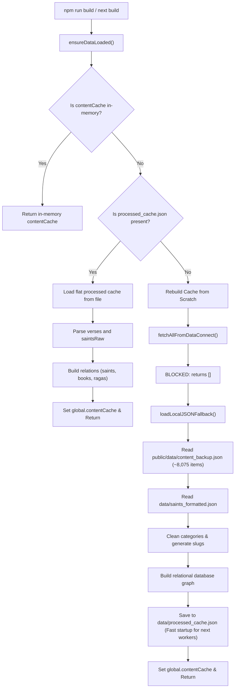
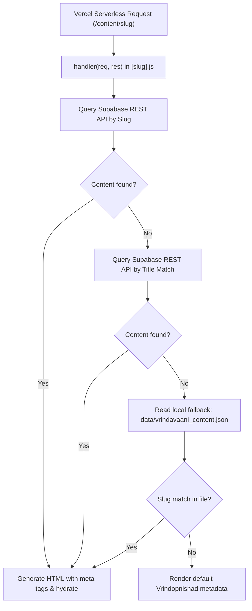

# Data Fetching and Routing Flow Report

Since disabling **Firebase Data Connect** to avoid database egress quotas and costs, the application employs a highly efficient local-first caching architecture. Below is the precise map of how data is fetched, cached, and served during different phases of the application.

---

## 1. Build-Time Data Flow (`npm run build`)

During static page generation, Next.js worker processes call `ensureDataLoaded()` to resolve the content database. The flow is as follows:

---

## 2. API Route & Serverless Handler Data Flow (`/content/[slug]`)

When crawlers, search engines, or users request a specific content page dynamically (e.g. via `/content/[slug]` serverless routes handled by Vercel), the application retrieves the details dynamically:

### Data Sources & Source of Truth:
1. **Supabase Database:** Acts as the active cloud source of truth for dynamic queries.
2. **Local Backup (`public/data/content_backup.json` & `vrindavaani_content.json`):** Acts as the offline local fail-safe, containing the complete corpus of ~8,075 items.
3. **Data Connect:** Fully bypassed (queries are blocked at the code level and return `[]`).

---

## Summary of Optimization Benefits
- **Zero Firebase Egress:** Build workers compile the site using local cache files, entirely eliminating billing and API rate limits.
- **Fast Build Times:** Local JSON parses in milliseconds, compared to minutes of slow network queries.
- **Resiliency:** If the Supabase API is down or rate-limited, the system falls back gracefully to local files to serve SEO meta tags.
